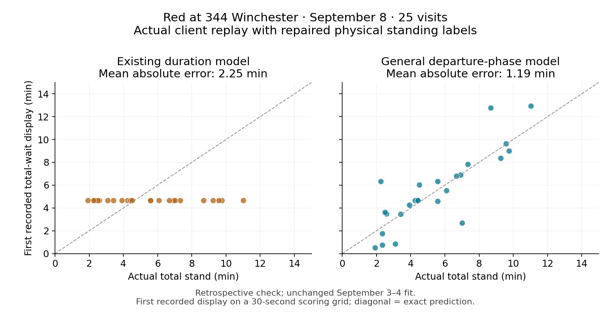

# Yale shuttle accuracy evaluation

**Submission status, September 9:** the accuracy implementation is on branch `codex/generalized-shuttle-eta` for review. The unrelated Arwa Coffee lookup release replaced the overnight accuracy build at 08:04:50; the subsequent production build observed at 08:28 was `93aa45d81534`, without this standing model. Deployment requires the owner's explicit permission and must run through Git and CI. The nightly refresh timer remains disabled; the separate read-only morning scoring timer is scheduled for 10:05 ET. A read-only production schema audit found that migration 0017's timestamp, SQL hash, three tables and index already match this branch. No production table deletion or migration rewrite is needed for that observed state. See [migration verification](standing-forecast-operation.md#reintroducing-migration-0017).

The accuracy problem is the time until a specific bus reaches a specific boarding stop, including any wait before that bus leaves its current stop. At 344 Winchester, the displayed expected total stand was often about five minutes even when the Red bus stayed closer to ten. That error then carried into the ETA at Division / Prospect. The selected general model passes the frozen offline acceptance checks. It learns departure timing from each bus’s previous confirmed loops, combines that evidence with historical standing durations, and updates the remaining wait as the bus continues standing. There are no Red- or Winchester-specific corrections. This is a validated improvement over the baseline, not proof of a globally optimal estimator.

## Derivation from the rider's question

Let the available information at time `t` be `H(t)`: the route geometry, every GPS observation already collected, the current rest clock, prior confirmed stops and departures, and historical trips completed before the model was fitted. Let `T` be the arrival time at the boarding stop. The quantity to estimate is the conditional distribution `P(T − t | H(t))`.

If the objective is mean absolute error, the correct point prediction is the median of that distribution. Squared error would instead select its mean. A rider also needs a useful uncertainty range: a narrow range that misses the bus often is not an improvement. This study therefore selects using a proper distribution score and checks median error, interval coverage, and both directions of large mistakes. Predicting too little wait and predicting too much wait are reported separately.

There are two linked subproblems. First, infer the bus's position in the route sequence and whether it is driving, standing, or repositioning. Coordinates alone cannot resolve a route that doubles back or a vehicle that moves around a depot without departing. Second, predict the remaining time conditional on that state. A better coordinate matcher cannot by itself predict a dispatcher's next departure.

For a bus already standing, let `S` be the total stand and `r` the elapsed stand. The remaining-time distribution follows the survival identity

```
P(S − r > u | S > r, context)
    = survival(r + u | context) / survival(r | context).
```

This also applies at `r = 0`: knowing the bus is standing removes the mass assigned to a pass with no stand. Subtracting elapsed time from an unconditional median is generally wrong. A fixed five-minute promise is also unjustified when continued standing changes what the observations imply about the departure.

Recent loops can supply a useful context. Suppose a bus last departed a stop at `D`, its learned recurring period is `P`, and it returns at `A`. A candidate total wait is roughly `max(0, D + P − A + error)`. An early return then permits a longer hold without implying a later departure. This is a hypothesis to test wherever the data supports it, not a rule attached to Red or Winchester. Yale's published Red description confirms offset departures and variable loop durations, but supplies no exact timetable of stop departure times. [Official Red route description](https://your.yale.edu/media/3096/download?inline=)

The broader conditional model can also learn from the stop's past duration distribution, time of day, time away, prior completed loops, and elapsed standing. It must handle missing history and new routes by pooling evidence. A route or stop identifier can select learned parameters; it should not select a hand-written correction.

## Baseline implementation

The server already collects positions and records arrivals, stop visits, legs, and rest clocks. The issue is not an absence of server-side route tracking. The browser maintains a separate probability distribution over route cells and movement modes, then combines current-stop residual time, driving time, and future-stop time into arrival distributions. Quantile tables and pooled distributions provide most of its timing model.

That decomposition is sensible. The unsupported assumption is that a pooled stop-duration distribution contains enough context for the current visit. It can combine short holds, long holds, different return times, and different service conditions into a median that describes none of the current conditions well. The display's non-increasing remaining-time limit can preserve an earlier optimistic forecast even after further observations favor a longer wait.

There is also an architectural question about history. A newly opened browser begins with less movement history than an established browser, although the server has observed the bus throughout. A matched replay compares a continuously updated client with a fresh client at the same query times. This measures the value of history before proposing that the server own the common estimator state.

No finite benchmark proves an implementation globally optimal. The decision is which general method is best supported by these observations, whether its improvement transfers to separate days and routes, and whether it can operate reliably within this application.

## Data and evaluation design

The frozen dataset is built from authenticated server archives and local raw captures. Genuine split stop-visit and leg history begins on September 3; older legacy arrivals and segments use different definitions and are not silently substituted for pinned-stand labels. Input hashes, coverage, topology variants, and split rules are stored with the evaluation artifacts.

September 3 supplies discovery and training; September 4 supplies development validation. Candidate settings and source hashes are frozen before scoring September 5–6 and the partial September 7 capture. Those dates were used in earlier repository work, so they are reserved for this comparison, not a pristine external test. September 8 is the previously examined regression day. Newly archived September 9 observations can supply a prospective check after the candidate freeze.

Each completed stand receives equal weight, with its forecast moments sharing that weight. This prevents a ten-minute stand from creating twenty times as many independent examples as a short stop. Full arrival forecasts are grouped by their target physical arrival. Whole-visit bootstrap intervals are supplemented by vehicle/day clustering because successive trips share operating conditions.

Historical database rows lack exact insertion timestamps. Features and training labels are therefore withheld until a conservative confirmation proxy or an observed archive timestamp. The current visit's eventual departure and future GPS positions are labels, never features. Unresolved, passed, unpinned, and censored observations remain visible in coverage counts.

Physical arrival labels use a first crossing into a 50-meter radius, with at most 30 seconds between observations and a 120-meter reset. An initially captured bus already inside the radius is left-censored. A crossing after a recording gap cannot be matched to a forecast before that gap. Repeated stop occurrences and route-order changes are tracked explicitly; unresolved historical occurrence mappings are not guessed.

Production tracking continued, but the older local raw recorder had stopped. A new read-only capture process preserves the server's records before its six-hour raw retention, partitions positions by their observation's UTC date, and stores immutable timestamped snapshots. This is evaluation infrastructure, not a change to the production estimator.

## Historical label integrity

A route-level failure triggered an independent check of the historical standing clocks. A geometry-only audit, constructed without model predictions, found **63 of 2,752 uniquely matched physical rests omitted more than two minutes** from their stored standing duration. This occurred across eight routes, including fifteen Red visits. Fifty-nine of the 63 cases had exactly matching physical and stored departure timestamps, locating the discrepancy at the start of the wait. The audit also found long physical rests classified as passes. [Audit summary](data/standing-label-integrity-2026-09-04.json).

For example, a Gold bus entered the 75-meter stop radius at 12:29:41 ET, waited near the stop, and departed at 12:42:59. Its stored record started at 12:41:59 and therefore called this a one-minute stand. Replaying the **existing production detector** on the raw observations recovers the earlier pin and the same departure. The original physical-arrival dataset already contained the earlier crossing before this audit; the investigation did not infer it from a favorable model error.

This matters in two ways. Truncated historical durations can teach a timing model that long waits were short. They can also penalize a model for correctly predicting a longer wait during evaluation. The original failed Gold guard remains recorded. A general label rebuild must cover every route, retain censoring and unmatched visits, and restore early displayed predictions that the old late-pin capture omitted. It must leave fitted models and their historical input features unchanged when measuring the effect of the label repair.

The component/library scores below are the **original legacy-label experiment**. They preserve what selected the candidate, but label contamination weakens their interpretation as physical-accuracy rankings. In particular, the earlier near-tie between coherent gradient boosting and the analytic model cannot establish a final library winner from those scores alone.

## Open-source alternatives

| Alternative | What it contributes | What this study can establish |
|---|---|---|
| scikit-learn histogram gradient boosting | Quantile regression with categorical features, missing values, and visit weights | A real benchmark on the same stored stands, followed by inference parity and runtime checks if selected |
| OneBusAway `trip-updates`, the maintained TransitClock fork | A complete vehicle-to-prediction engine with tracking, timing, and replay facilities | Adapter feasibility; no claim of better accuracy without a faithful matched replay |
| Valhalla Meili | Probabilistic map matching of GPS traces | A possible tracking component, not a terminal-departure predictor |
| Survival-analysis libraries | Standard estimation and conditioning of event-duration distributions | Useful mathematical components; still require route history, context, and integration |

The installed scikit-learn version used in the experiment is 1.8.0. Its quantile loss estimates conditional quantiles; it does not guarantee that their intervals are calibrated on another day, so empirical coverage remains part of the decision. [Versioned estimator documentation](https://scikit-learn.org/1.8/modules/generated/sklearn.ensemble.HistGradientBoostingRegressor.html)

A complete TransitClock trial needs stop occurrences, route shapes, service/trip/block data, and a vehicle adapter. The repository supplies route geometry and vehicle observations but no verified static GTFS timetable. Inferring that timetable from held-out trips would leak the answer. The engine therefore remains a concrete integration alternative, not a measured winner tonight. [OneBusAway prediction engine](https://github.com/OneBusAway/trip-updates), [setup documentation](https://github.com/OneBusAway/trip-updates/blob/develop/docs/setup.md)

Meili's scope is GPS map matching. Even a perfect matched position cannot reveal a hold's departure without a timing model. [Meili documentation](https://valhalla.github.io/valhalla/meili/)

The operator's existing ETA feed was also tested as a possible better signal, using recorded September 8 responses and the same served-arrival targets. A response becomes usable only after the next recorded request proves the preceding response had been received; its calculation clock must already be known. This avoids treating a request-start timestamp as receipt time. With source forecasts at most thirty seconds old, 9,102 query-target pairs are available (8.68% of the common cohort): equal-arrival MAE is **128.75 seconds for the baseline, 127.11 for the selected model, and 265.04 for the operator**. The 180-second sensitivity covers 55.82% and has the same ordering. These are retrospective, coverage-limited point comparisons, not a reason to blend or adopt the operator feed untested. The sparse thirty-second Red-only subset is not independently decisive.

## Model selection and separate-day results

The selected model is a mixture of the existing duration prior and a learned recurring-departure prior. Its mixing weight is fitted per route occurrence with shared shrinkage, using equal-visit remaining-time quantile CRPS. Conditioning the resulting mixture on continued standing automatically changes the relative weights: a component that made a long wait unlikely loses credibility as that wait continues. The algorithm contains no Red, Winchester, or other route/stop allowlist.

The family and all fitting settings were frozen at **00:13 ET on September 9**, before opening this study's reserved results. Refitting on September 3–4 took 193 seconds and produced a 175 KB model. The live collector reads cached contexts. Production training is now executed outside the web VM after the first live worker exposed shared-CPU contention, as described below.

Development comparisons use the same 3,411 observed stands and 19 midpoint quantiles. All errors below are seconds, averaged with equal weight per visit.

| September 4 development | Remaining MAE | Quantile CRPS | Initial total MAE | 80% coverage |
|---|---:|---:|---:|---:|
| Existing duration model | 33.71 | 24.48 | 41.35 | 83.2% |
| Selected general phase mixture | **31.20** | **22.92** | **38.01** | **84.0%** |
| Coherent HistGB, small | 30.91 | 22.93 | 37.17 | 75.5% |
| Coherent HistGB, medium | 31.06 | 23.39 | 36.33 | 75.1% |
| Direct remaining-time HistGB | 26.16 | 19.18 | 45.04 | 77.1% |

The direct learner's better overall average concealed a worse answer to the user's question. On long initial waits, its forecasts were more than two minutes too short about 70% of the time, versus 39% for the baseline. A duration-normalized variant also failed that long-initial-wait check. These candidates were rejected before reserved scoring. The coherent library candidates were competitive: the smaller model tied the selected model's proper score, while the medium model did better on Red's initial wait. The selected model supplied better interval coverage and a more balanced pair of large-error tails, with no material route regression. This is a measured tradeoff, not a claim that a hand-written model always beats a library.

Portable Node inference of the library candidate was also implemented and checked against Python; maximum error was below one trillionth of a second on the explicit query parity sample. Adopting that learner would not require Python in the live server. The decision against it is based on forecast behavior, not a deployment-language objection.

The fixed September 3–4 fit was then scored on September 5–7:

| Reserved comparison: 1,989 visits | Existing | Selected |
|---|---:|---:|
| Remaining MAE | 46.87 s | **44.42 s** |
| Quantile CRPS | 35.28 s | **33.14 s** |
| Forecast overstates wait by >2 min | 4.34% | **4.28%** |
| Forecast understates wait by >2 min | 6.55% | **5.88%** |
| 80% interval coverage | 85.7% | **86.6%** |

The remaining-MAE change was −2.45 seconds; a vehicle/day block bootstrap gave a descriptive 95% interval of −5.51 to −0.69 seconds across 27 blocks. Most visits were unchanged: 1,758, versus 146 improved and 85 worsened. No route's mean error increased in this confirmation set. Long holds remain difficult, with MAE 191.85 → 177.17 seconds.

**These confirmation days contain no Red Line observations.** September 5–6 cover weekend service and September 7 has only fifteen post-midnight visits. They support general transfer to other routes, not a separate-day confirmation of weekday Red service.

On the previously examined September 8 regression day, Red at 344 Winchester has 27 component visits. Initial total-stand MAE fell **141.91 → 62.61 seconds**, and remaining-stand MAE fell **119.26 → 62.18 seconds**. The component study conditions on the stored pinned clock. A separate replay of the actual browser display, using the published model parameters captured from production, also improves Red at 344 Winchester: first total-stand MAE **141.91 → 69.57 seconds**, and remaining-stand MAE **120.70 → 60.88 seconds** across 27 visits. Initial totals more than two minutes too short fell **37.0% → 7.4%**; those more than two minutes too long fell **25.9% → 7.4%**. These are retrospective results with the fixed September 3–4 fit, not a prospective weekday confirmation.

Those original 27-visit component and display results are preserved as legacy-label diagnostics. The final physical-label rider-display comparison below contains 25 completed paired visits. [Archived component figure](data/red-general-first-total-2026-09-08.png), [archived data](data/red-general-first-total-2026-09-08.csv).

## Unchanged models against repaired physical standing labels

The measurement repair preserves fitted parameters and the original historical input records. It replays the existing production detector and visit reducer on continuous raw tracks, preserves censoring, and uses exact canonical occurrences. For the actual client, only scoring labels and current-hold attribution change; every previously captured display prediction is verified unchanged. Component diagnostics instead query the unchanged model at the corrected current pin and elapsed-time grid, so their query clocks change with the independently reconstructed event. Original-to-rebuilt visit matching is mutual and unique within thirty seconds of departure; it is diagnostic and does not select the full reconstructed cohort. The rule, dependencies, geometry, and input hashes were frozen before any repaired scores were read. The original failed Gold result remains archived.

The repaired development component comparison has **3,444 completed stopped visits and 11,748 query moments**, with a query at each corrected causal pin. These are component queries, not literal first UI displays. All 2,526 previously seen-pattern visits and 918 new-pattern visits remain visible. No original first query was hidden by the thirty-minute scoring horizon.

| Repaired development, frozen models | Remaining MAE | Quantile CRPS | Initial total MAE |
|---|---:|---:|---:|
| Existing duration model | 30.31 s | 22.63 s | 44.42 s |
| Selected phase mixture | **29.19 s** | **22.02 s** | **42.53 s** |
| Direct remaining-time HistGB, medium | 28.19 s | 20.70 s | 51.30 s |
| Coherent duration HistGB, medium | 30.08 s | 22.72 s | 40.63 s |

The direct learner still has a tradeoff: better aggregate remaining-time error, worse initial waits, and four material route regressions. The coherent duration learner improves aggregate initial error, partly through extrapolation to new patterns where the analytic model falls back. On previously seen patterns the analytic initial error is lower (30.42 versus 32.00 seconds); the coherent learner also has weaker remaining-time accuracy, lower interval coverage (74.86% versus 85.73%), and a material Brown initial-total regression. The selected model has no material route regression in this corrected comparison. All nine library fits reproduced their original-query controls before emitting new predictions; none was retrained. This supports the selected practical tradeoff, not a claim about the best possible model trained on fully corrected data.

The full **actual-client** development rerun restores displays lost behind late stored pins. Initial total MAE improves **47.93 → 45.46 seconds** across 2,633 visits; the vehicle/day interval for the difference is −5.31 to −0.55 seconds. No route crosses the original material-regression threshold. Gold improves **65.08 → 50.56 seconds** across 67 first displays. On the same 63 mutually matched Gold first displays, changing only the verified clock changes the baseline/candidate result from **74.31/82.79** with old labels to **66.09/48.00** with repaired labels. The earlier guard failure was therefore a measurement failure, rather than an exemption granted to a favored model.

The tradeoffs remain visible: Gold predictions over two minutes too long rise **5.97% → 10.45%**, while those too short fall **8.96% → 1.49%**. Its data comes from one vehicle/day, so a vehicle/day uncertainty interval would be unjustified. All 7,856 previously captured development display predictions were verified unchanged; the repaired capture restores 656 earlier forecast moments and 58 earlier first displays.

The **corrected reserved component confirmation** evaluates only the already selected model with its unchanged September 3–4 fit and original historical features. Across 1,968 visits, remaining MAE improves **46.60 → 44.60 seconds** and quantile CRPS improves **36.10 → 34.48 seconds**. Vehicle/day 95% intervals for the differences are −4.58 to −0.48 and −3.92 to −0.36 seconds, respectively, across 27 blocks. Both directions of errors over two minutes improve. No route crosses the frozen material-regression guard, either over all query moments or at the original initial query.

The fixed thirty-minute horizon retains 9,080 of 9,194 reserved component queries and excludes two original initial queries. Both excluded waits exceed fifty minutes, and both arms make the identical 36-second initial prediction; they remain explicit failures in the supplementary report. Including all original initial queries gives total MAE **92.85 → 91.62 seconds**. No later query is substituted for an excluded first query.

The **repaired actual-client display** comparison uses the same browser code and parameters in both arms. September 4 development and September 5–7 confirmation use compiled parameter defaults; September 8 uses the captured published `fit-2026-09-07` parameter set. The development standing model is fitted on September 3, while confirmation and regression use the frozen September 3–4 refit. “First display” below means the earliest recorded display on the fixed approximately thirty-second scoring grid; browser state still updates on every five-second GPS poll. It is not necessarily the first literal screen refresh after arrival.

| Actual-client physical-label cohort | Paired first displays | First total MAE, existing → selected | Remaining MAE, existing → selected |
|---|---:|---:|---:|
| September 4 development | 2,633 | 47.93 → 45.46 s | 36.96 → 35.63 s |
| September 5–7 reserved | 1,070 | 109.53 → 107.29 s | 59.00 → 55.35 s |
| September 8 regression | 2,496 | 46.17 → 43.70 s | 33.56 → 32.03 s |
| September 8 Red at 344 Winchester | **25** | **134.86 → 71.17 s** | **115.34 → 62.29 s** |

Vehicle/day intervals for first-total error changes exclude zero in all three date cohorts: −5.31 to −0.55, −4.15 to −0.65, and −6.39 to −0.17 seconds. Every cohort passes the original route guard. Reserved long holds remain poorly predicted, although their first-total MAE improves **414.48 → 404.78 seconds** over 245 visits. Reserved capture has two baseline-only later displays and no unpaired first displays; missing forecasts and censored or ambiguous visits are reported separately. Wrong inferred occurrences remain errors in the primary score rather than being filtered away.

For the user’s reported Red wait, first-total error falls from **2.25 to 1.19 minutes**, about 47%. Initial overestimates greater than two minutes fall **24% → 8%**; underestimates fall **36% → 8%**. These 25 visits are from the already examined September 8 regression day. They do not establish a prospective morning-service win.



The diagonal is an exact prediction. The baseline repeatedly predicts roughly five minutes while actual waits vary substantially. The general model responds to the bus’s departure history, with remaining errors visible. [Exact displayed predictions and physical clocks](data/red-first-display-repaired-2026-09-08.csv), [vector figure](data/red-first-display-repaired-2026-09-08.svg).

## Full-client validation and remaining limitations

The full-client replay uncovered a measurement problem before model acceptance. A bus can pass within fifty meters of a stop while serving another part of its route. Matching every prediction to the next geographic near-pass yielded misleadingly large errors. The corrected, separately frozen target rule keeps independent GPS arrival clocks but corroborates the intended served visit, restricts the cohort to the next one through five actual served occurrences, and rejects recording gaps and already-arrived queries. Both model arms use exactly that rule.

A history diagnostic on September 4 contains 116,402 forecasts grouped into 5,500 physical arrivals. A continuously updated browser had MAE **139.62 seconds**, while a fresh browser at each query had **165.75 seconds**. This supports investigating shared server-owned tracking state as a further architecture improvement. It does not establish that moving the estimator to the server, by itself, would remove the whole difference. Green and Purple still show substantial tracking/route errors even after correcting the labels.

Paired full-client runs keep the client code and query cohort identical and enable or omit the selected standing context. With compiled model parameters, September 4 arrival MAE improves **139.62 → 138.50 seconds** (116,402 matched forecasts, 5,500 arrivals), and September 8 improves **123.62 → 122.28 seconds** (104,900 forecasts, 4,937 arrivals). Vehicle/day bootstrap intervals for the changes are −2.40 to −0.12 and −3.32 to −0.23 seconds, respectively. There are no unmatched predictions in either comparison.

The tail tradeoff matters: September 4 forecasts over two minutes too long rise **12.61% → 13.05%**, while those too short fall **9.74% → 9.00%**. September 8 shows the same direction (**10.74% → 11.03%** too long; **10.42% → 9.65%** too short). The standing model cannot be presented as improving every aspect of downstream arrivals.

The reserved full-ETA replay has 99,062 forecasts grouped into 4,152 served arrivals. MAE improves **201.93 → 200.06 seconds**, with a vehicle/day interval for the difference of −5.32 to −0.10 seconds. Overestimates greater than two minutes rise **16.20% → 16.50%**; underestimates fall **18.89% → 18.25%**. No supported route crosses the original material-regression guard, but overall improvement is modest and absolute errors on some routes remain large.

For the specific Red 344 Winchester → Division / Prospect development subgroup, the original stored-hold attribution gave 28 arrivals and essentially unchanged error (**98.79 → 99.78 seconds**). Repaired physical current-hold attribution, with the same full-ETA predictions and physical targets, gives 27 arrivals and **112.15 → 99.80 seconds**. Its whole-arrival uncertainty interval still includes zero (−33.19 to +8.45 seconds). Overestimates greater than two minutes rise **7.59% → 17.84%** while underestimates fall **26.69% → 10.28%**. This is a qualified development diagnostic, not a decisive separate-weekday win.

On September 8, the fixed September 3–4 fit with published parameters improves this downstream Red cohort from **103.65 → 61.64 seconds** MAE across 26 arrivals and 273 query moments. The vehicle/day interval for the change is −65.62 to −15.33 seconds. Predictions more than two minutes too early fall **26.17% → 4.96%**, while those too late rise **5.00% → 5.82%**. This directly tests the requested destination ETA, but remains retrospective.

The original Gold first-total failure and observed-clock sensitivity are retained in the artifacts. The independent all-route label audit and unchanged-prediction rerun above resolve that failure using physical evidence; merely choosing the favorable clock metric would not have been sufficient.

The selected model needs a previously confirmed departure from the same bus and occurrence that day. It falls back for the first such visit, missing history, zero learned phase weight, or an unresolved route pattern. It cannot promise to fix every first trip of the morning. An inherited extreme-tail numerical cutoff can still produce zero remaining time after an exceptionally long fallback wait; the audit found no such cutoff in the selected reserved forecasts, but did find it in development fallback cases. That limitation was not silently changed after the model freeze.

For live fitting, the operational policy is the last two completed observed service dates per route, searched within thirty calendar days. This preserves weekday evidence over a weekend without route-specific exceptions. It is an explicit extrapolation from the fixed two-day study, frozen separately before prospective scoring. Twenty thousand training rows is a resource guard; an oversized or failed fit keeps the normal duration model available. Exact training dates, fit age, topology identity, and reference confirmation times must remain observable.

The production rolling policy was also tested retrospectively on September 8 with its own causally available training snapshot and the published model parameters. With a continuously updated browser, whole-cohort arrival MAE improves **124.26 → 122.93 seconds** across 4,937 arrivals; a fresh-browser replay improves **145.36 → 144.06 seconds**. Both vehicle/day intervals exclude zero and both pass route guards. The Red Winchester → Division / Prospect cohort improves **105.05 → 61.58 seconds** warm and **112.13 → 66.89 seconds** cold. The warm whole-cohort overestimate tail worsens slightly (**12.11% → 12.44%**) while the underestimate tail improves (**10.20% → 9.39%**). Rolling operation is therefore supported by one retrospective simulation as well as the fixed-fit study; future daily replacements remain to be measured.

## Implementation and operation

The server now supplies an optional standing distribution tied to an exact canonical route occurrence, a fit known before the current stand, and a previous departure confirmed before that stand. New stop-visit metadata records actual observation availability and route topology. Legacy history keeps its conservative availability rules; it is not backfilled with invented timestamps. Ambiguous bus identities, changed topology, or insufficient history use the existing duration fallback.

Total standing time, conditional remaining time, and departure probability over the next polling interval use the same probability distribution. The client uses this context in both its movement filter and arrival estimates, and clears the old optimistic countdown ceiling for a contextually modelled current stand. A separate route-index correction ensures standing displays use the canonical stop occurrence. These changes apply to every route under the same rules.

Inference reads a cached model on the web server. The first production worker exposed an operational issue: a worker thread shares the VM’s CPU quota with HTTP and tracking. Fly currently allows a shared CPU 6.25% sustained use, with a burst balance. Public requests slowed during fitting and several timed out; a separate forty-request localhost probe had no failures but a 2.23-second maximum. This supports CPU contention, without proving the cause of every network failure. [Fly CPU quota documentation](https://fly.io/docs/machines/cpu-performance/).

The proposed execution policy therefore disables automatic web-VM fitting with `SHUTTLE_STANDING_FORECAST=0`. The historical overnight release used the already validated September 9 fit, verified against the exact live algorithm fingerprint and loaded through the production cache reader before atomic installation. The fitting mathematics, historical inputs, selected dates, and 48-hour maximum fit age are unchanged. The original worker limits remain available in the code but are disabled by the proposed Fly configuration. [Cache/runtime implementation](../services/shuttle-v2/src/calibrator/standingForecast.md).

A prepared local daily job uses a consistent online backup, runs the unchanged fitter, verifies source/algorithm identity and causal training cutoffs, then installs the new cache atomically and restarts the server to load it. Its disabled timer is configured for 00:30 Eastern and permits publication/restart only before 04:00 with a healthy server and zero known buses. Activation requires separate approval, and this local machine and its Fly credentials must remain available. Failure preserves the previous cache; stale or incompatible fits use the normal duration fallback. New observation metadata and existing restart-persistence tests protect the full standing clock. The cache and authenticated diagnostics record training dates, exclusions, and execution provenance. No model settings are changed by the timer.

The complete local refresh check passed against the preserved production snapshot in 172 seconds: 11,415 training rows, unchanged source data, exact equality to the previously validated fitted statistics, and acceptance by the real production cache loader. Four JavaScript and six Python operational checks passed, and systemd validated both unit templates. The nightly timer is prepared but remains disabled while committed production integration is pending. [Operation and setup](standing-forecast-operation.md). The separate read-only morning scoring timer is enabled for 10:05 ET on September 9; it records the 08:04 deployment change and preserves missing contexts in its coverage counts.

The historical overnight deployment used source identifier **`6a8d6f784bb32c52072842b786728b6531ccf37e`**, recorded in `deployment-source-manifest-v2.json` for 244 source/build inputs; it was **not a Git commit**. Its completed local pipeline passed backend/frontend typechecking, 2,179 tests in 84 files, frontend build, migrations against a throwaway database, API checks and Chromium page-load checks. The tab-walking loop did not prove that every tab was clicked because its button names were outdated. This deployment did not go through Git/CI and should not have occurred without the owner's permission. The temporary source-digest override has been removed from the proposed branch; future approved deployments use the existing committed CI process. These operational corrections do not change the selected estimator.

A read-only recorder preserves the existing server’s positions and visits before raw retention expires. A separate prospective writer records baseline, actual server-context, fixed-fit, and rolling-fit forecasts before their future outcomes. It keeps the actual served context separate from inferred shadow history. Both captures are scheduled through **10:00 ET on September 9**. There were no active buses at the time of overnight promotion, so live operational health must not be described as a prospective Red accuracy result.

## Reproducibility and acceptance

The submission branch includes master through `93aa45d81534`, retaining its
reversion of the directional cold-start change. On the merged branch, backend
and frontend typechecks, all **2,195 tests in 85 files**, twenty focused Python
checks, and the frontend build passed. An isolated browser preview clicked
Trip, Map and Issues without page errors or failed requests. Its recorded first
morning visit has no usable current-stop departure context and illustrates the
duration fallback, not an accuracy gain; map tiles were not visible. The
[preview and provenance](../pr-preview/generalized-shuttle-eta/README.md) make
these limits explicit. Six migration tests cover the observed production ledger
and schema, fresh upgrades, preserved synthetic data, and orphan-object failures.

The merged-client replay is complete, with the selected fit, historical inputs,
scoring code and physical labels unchanged. All supported route guards pass for
ETA, remaining wait and first recorded total stand. Reserved arrival MAE is
**201.94 → 200.10 seconds** across 4,152 arrivals; September 8 arrival MAE is
**123.93 → 122.50 seconds** across 4,937 arrivals. The vehicle/day 95% intervals
for the changes are −5.29 to −0.07 and −3.46 to −0.26 seconds respectively.
Overestimates greater than two minutes still rise by about 0.3 percentage points;
underestimates and standing-wait tails improve.

Red Winchester first recorded total-stand MAE remains **134.86 → 71.17 seconds**
across 25 visits. The requested Winchester-hold → Division / Prospect ETA is
**105.81 → 62.71 seconds**, across 269 query moments and 25 served arrivals, with
a vehicle/day 95% change interval of −71.24 to −15.33 seconds (three bus/day
blocks). This subgroup uses the scoring-only physical current-hold assignment,
not the client's inferred stop. The frozen repaired assignment excludes four
previously attributed query moments and adds none; the original 273-row subset
and its earlier score were reproduced exactly as a control. The broader set of
all Red queries to Division / Prospect is reported separately. These remain
retrospective results, not new prospective confirmation.

The [merged-client integration report](general-eta-integration-2026-09-09.md)
records cohort counts, tails, scope controls and artifact provenance. Earlier
numbers above retain their original source and attribution provenance; this
completed integration check supports the submitted client. The interrupted
baseline attempt was excluded and its completed retry alone was scored.

The source protocol and evaluation tools live in `services/shuttle-v2/scripts/eta-replay/general-eval/`; large inputs, predictions, fitted artifacts, and archived experiments live under `scripts/.eta-replay/overnight-2026-09-08/`. The earlier Red-specific code is preserved as an undeployed research baseline.

A replacement must improve held-out distribution accuracy and the actual rider-facing ETA replay, improve the reported Red failure, and avoid a material supported route-level regression. First displayed total waits, long holds, cold starts, fallback coverage, and errors over two minutes are reported alongside aggregate means. An unsuccessful candidate is retained in the experiment record rather than patched with route exceptions.

The recorded offline decision accepts the unchanged general phase mixture after all offline gates pass. The original failed Gold assessment remains archived beside the independent label-integrity evidence and corrected assessment. The recommendation is to review this model for an approved CI release, preserve prospective results, and continue improving shared tracking state and fallback behavior. A library replacement is not currently supported as a better overall choice; clean-label retraining and broader weekday data remain valid future comparisons. The historical release passed production browser page-load and API verification at approximately **02:26 ET on September 9**, build **`6a8d6f784bb3`**. The subsequent CPU-contention check led to the execution change above. The validated cached fit was installed at **02:42 ET** and loaded after the 02:43 restart; thirty subsequent public requests had no failures, a 105 ms median, and a 330 ms maximum. The local nightly fitting check and unit-template verification passed, but the refresh timer is disabled. No prospective Red accuracy result is claimed.
