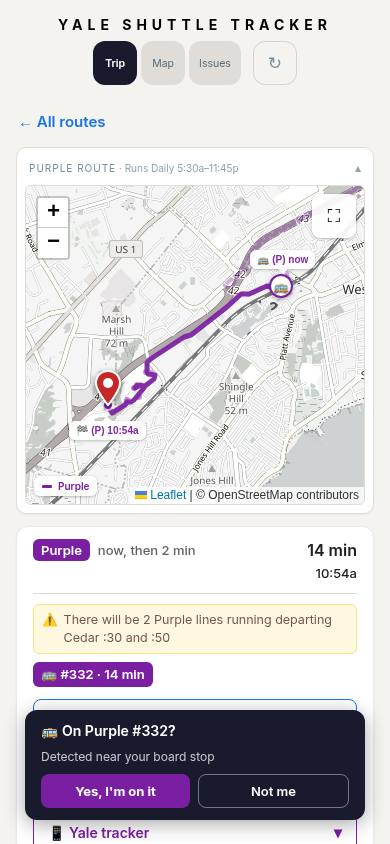
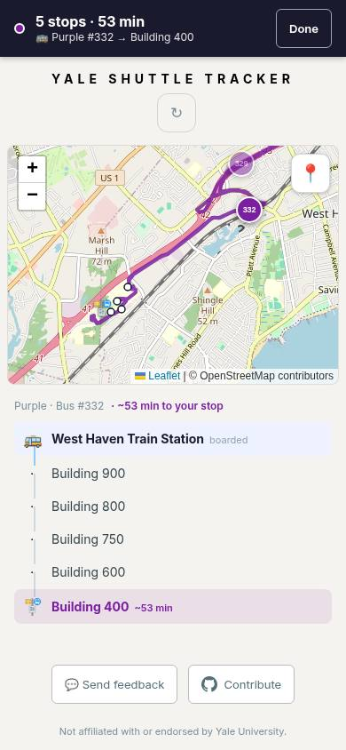
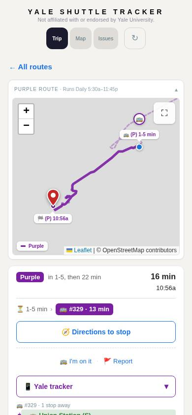

# High-priority Purple boarding mismatch — September 11

At 10:39:50 ET, the live rider at West Haven Train Station, heading to Building 400, was offered Purple #332 **now**, a **14-minute ride**, and **Yes, I'm on it**. Immediately after accepting, the ride page said **53 minutes**. GPS samples then followed #332 northeast to New Haven, rather than southwest toward West Campus. The previously suggested #329 had been shown about three minutes away.

The feed marked #332 at physical stop 127, but the estimator's canonical visit sequence distinguished the return pass from the later outbound visit. With the archived topology and calibration restored, the recorded GPS sequence gives #332 a near-zero station arrival at hop 1, another station arrival at hop 7, and Building 400 at hop 12. For #329 the station is at hop 1 and Building 400 at hop 6. The planner had paired the first physical pickup with the static short ride, ignoring which visit actually led to the destination.

The fix rejects a pickup only when same-bus, same-route arrivals positively show another visit to the pickup before the destination, with consistent ETA order. Missing or ambiguous evidence preserves the prior recommendation. The rule is shared by initial planning, live refresh, and nearby boarding confirmation; raw at-stop flags cannot restore a rejected visit. The initial planner retains its existing cold-start behavior. There is no exact-zero ETA test, estimator arithmetic change, topology change, or geofence change.

[Full before/after replay sweep and reproducible inputs](replay/README.md): no offered rides disappear; Red and Blue West remain unchanged.

The initial zero-arrival-only candidate was insufficient. A fuller browser fixture still showed #332 now with a short ride; that failed check prompted the occurrence-pairing fix. The regression now includes the archived route path and model parameters as well as GPS. These are an earlier calibration snapshot, so this is a causal fixture, not an exact numerical replay of every production estimate. Existing valid parked-bus boarding remains covered by planner tests.

The watcher followed the app's selected bus and used the matching auto-confirmation, so the visible recommendation mismatch is not explained by the stop-name parsing bug. The journey was later interrupted for watcher maintenance and is excluded from completed-trip accuracy statistics. Original raw logs and screenshots are retained in ongoing-rider-qa/rotation.

Validation: 106 focused planner/boarding/simulator-scoring tests, full backend/frontend typecheck, and production build pass. The refreshed controlled browser replay consumed 23 responses, selected outbound **#329**, showed **1–5 minutes to pickup** and **16 minutes total**, and did not offer boarding #332. No page errors. Map tiles were blocked and the temporary page was closed afterward.

[Browser result](browser-result.json). The after image uses recorded GPS and an earlier calibration snapshot, not live production or independent ground truth. PR #234 carries the change and merge status.
