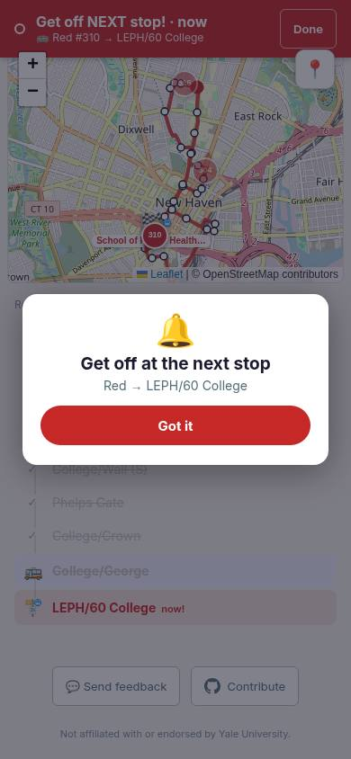

# Red arrival wording — September 11, 2026

At 07:48:20 ET the dedicated Red rider (Division/Prospect to LEPH/60 College, bus #310) captured an open “Get off at the next stop” prompt with “now!” on the destination row and “Get off NEXT stop! · now” in the banner.

The watcher was 22.5 m from the published exit coordinate. That proximity alone does not establish that the bus was stopped at the boarding curb. The stop anchor still indicated College/George. The conflicting “now” text came from formatting any ETA below 60 seconds as an arrival statement; it was not proof the get-off instruction was wrong.

The fix renders sub-minute ride predictions as “<1 min” in the banner, route summary and destination row. Stop-based “Get off here” and “Arriving at …” instructions retain their existing triggers. It changes no ETA arithmetic, GPS thresholds or stop anchoring. Regression coverage checks the sub-minute/one-stop combination and preserves the zero-stop instruction and minute estimates.

The screenshot is the original production capture, not an after image. Automated tests and typecheck validate this small text change; no additional browser was launched, keeping the two live watcher pages running on the Pi.

Separately observed pickup underestimates (29 vs approximately 37 minutes; 11 vs approximately 16 minutes) remain diagnostic evidence, not a causal model fix. GPS observations use the same upstream provider as the app.
